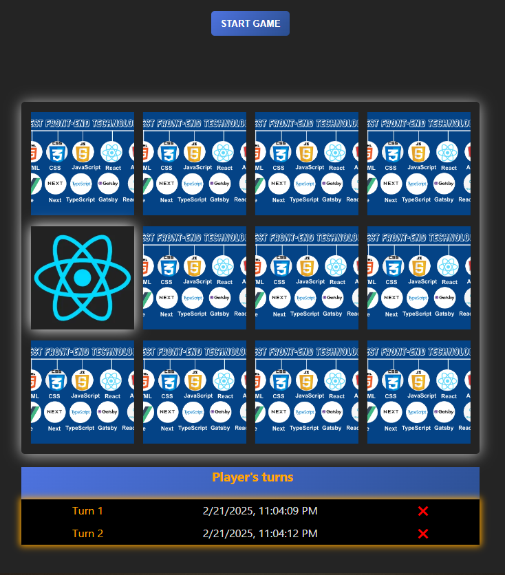

# React Memory Game

A responsive and interactive Memory Game built with React. Challenge yourself to match card pairs while tracking your time and number of moves. Designed to be fun, engaging, and a great exercise for improving your short-term memory!

## Table of Contents

- [Overview](#overview)
  - [Game Features](#game-features)
  - [Screenshot](#screenshot)
  - [Links](#links)
- [My Process](#my-process)
  - [Technologies Used](#technologies-used)
  - [Plans for Future Enhancements](#plans-for-future-enhancements)
- [Installation](#installation)
- [Author](#author)

## Overview

### Game Features

The goal of the game is to match pairs of cards. Users can:

- Play the game with cards that are shuffled each time the game starts.
- Click or hit enter or space buttons to flip cards to reveal their image and try to match pairs.
- Track the number of moves and game log with player turns.
- Restart the game once all pairs are matched.
- Restart midgame
- Change difficulty midgame
- Read game log with turns played
- See game difficulty level display
- Card flip animations
- Matched pair animations
- Responsive design
- Visually engaging

### Screenshot



### Links

- Solution URL: [GitHub Repository](https://github.com/Zdravko93/react_memory_game)
- Live Site URL: [Live Demo](https://zdravko93.github.io/react_memory_game/)

## My Process

This project was built to practice my **React** skills, focusing on **state management** and **logic implementation**. I wanted to create a fun and interactive game that could also serve as a great learning experience for understanding how to handle dynamic data, manage state, and implement game logic in React.

### Technologies Used

- **React**: Core library for building the UI with components
- **JavaScript**: Modern JavaScript for game functionality and logic.
- **useReducer and useEffect**: React hooks used for managing game state, card flips, and game logic.
- **CSS Modules**: Scoped styling to keep styles modular and maintainable.

### Plans for Future Enhancements

Although the core gameplay is functional, several enhancements are planned to improve structure, usability, and scalability:

- **Global State with useContext**
  Replace multiple useState hooks with useContext to centralize state and avoid prop drilling, making state easier to manage across components.

- **Difficulty Settings**
  Add an option for players to choose difficulty (Easy, Medium, Hard), which will dynamically adjust the number of cards and layout.

- **Improved Animations**
  Introduce smoother transitions and subtle animations for card flips, matches, and resets to enhance user engagement.

- **Scoring Feedback / Stats**
  Display performance feedback such as accuracy, or player score at the end of the game.

## Installation

Follow these steps to run this project locally:

1. Clone the repository:
   ```bash
   git clone https://github.com/Zdravko93/react_memory_game.git
   ```
2. Install the required dependencies:
   ```bash
   npm install
   ```
3. Start the development server:
   ```bash
   npm run dev
   ```
4. Visit http://localhost:3000 to play the game locally

## Author

Github: [Zdravko93](https://github.com/Zdravko93/react_memory_game)
Frontend Mentor: [@Zdravko93](https://www.frontendmentor.io/profile/Zdravko93)
